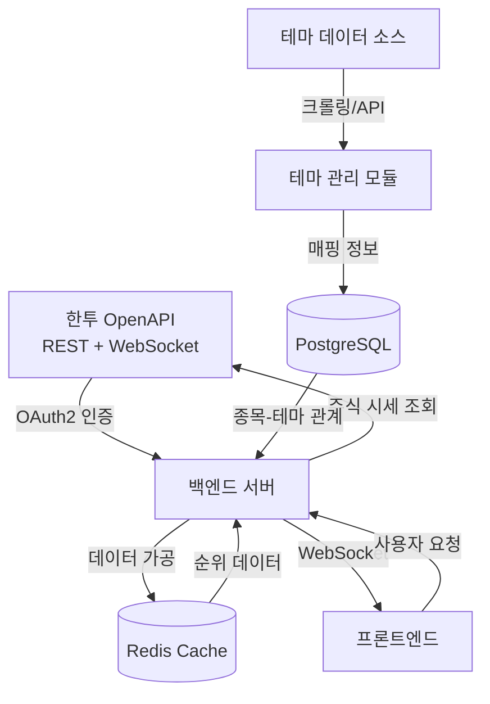

# 프로젝트 분석 문서

## 1. 개요
### 1.1 문서 정보
- **작성일**: 2026-02-27 (Updated)
- **작성자**: 장현석
- **버전**: 3.0
- **상태**: 완료

### 1.2 목적
본 문서는 StockThemeBoard 프로젝트의 요구사항을 분석하고, 주식 테마별 종목 정보를 효과적으로 시각화하기 위한 시스템 설계의 기초 자료로 활용됩니다. 주요 범위는 데이터 수집, 테마 분류, 사용자 인터페이스 설계를 포함합니다.

---

## 2. 배경 및 필요성
### 2.1 배경
주식 시장에서 특정 테마를 중심으로 투자하는 경향이 강해지고 있으나, 테마별 종목 정보를 효과적으로 시각화하고 분석할 수 있는 도구가 부족합니다. 본 프로젝트는 이러한 시장의 요구에 부응하여, 주식 테마별 종목 정보를 시각화하고 분석할 수 있는 웹 애플리케이션을 개발하는 것을 목표로 합니다.

### 2.2 문제점 및 개선 필요사항
- **정보 분산**: 주식 테마별 종목 정보가 여러 플랫폼에 분산되어 있어 효율적인 모니터링이 어려움
- **실시간성 부족**: 기존 무료 도구들은 실시간 데이터 제공이 제한적이며, 거래량/거래대금 순위 정보 업데이트가 느림
- **유료 서비스 비용**: 티마와 같은 유료 서비스는 개인 투자자에게 부담스러운 요금 구조
- **제한적 커스터마이징**: 기존 서비스들은 사용자가 원하는 테마별 필터링 및 정렬 기능이 제한적
- **데이터 가공 어려움**: Raw 데이터를 직접 가공하여 의미 있는 인사이트를 도출하기 어려움

---

## 3. 요구사항 분석
### 3.1 기능 요구사항
| ID | 요구사항 | 우선순위 | 비고 |
|----|---------|---------|------|
| F-001 | 한국투자증권 OpenAPI 연동을 통한 실시간 주식 데이터 수집 | 높음 | ✅ 완료 |
| F-002 | 테마별 종목 분류 및 관리 | 높음 | ✅ 완료 (섹터 오버라이드 맵 18개) |
| F-003 | 거래량 기준 TOP 4 종목 표시 (테마별) | 높음 | ✅ 완료 |
| F-004 | 거래대금 기준 TOP 4 종목 표시 (테마별) | 높음 | ✅ 완료 |
| F-005 | 테마 목록 조회 및 선택 기능 | 중간 | ✅ 완료 |
| F-006 | 종목별 상세 정보 표시 (현재가, 등락률, 거래대금, 캔들 차트) | 중간 | ✅ 완료 |
| F-007 | 데이터 자동 갱신 기능 (60초) | 높음 | ✅ 완료 |
| F-008 | KRX/NXT/ALL 멀티 마켓 토글 | 높음 | ✅ 완료 |
| F-009 | 코스피/코스닥 지수 실시간 표시 (30초 갱신) | 높음 | ✅ 완료 |
| F-010 | 마켓 영업시간 자동 판별 | 중간 | ✅ 완료 |
| F-011 | 사용자 관심 테마 즐겨찾기 기능 | 낮음 | 예정 |
| F-012 | WebSocket 실시간 업데이트 | 낮음 | 예정 |

### 3.2 비기능 요구사항
| ID | 요구사항 | 기준 | 비고 |
|----|---------|-----|------|
| NF-001 | 성능 | API 응답 시간 1초 이내, 갱신 주기 3초 대응 | Redis 캐싱(3초/1시간) |
| NF-002 | 보안 | Let's Encrypt SSL(HTTPS), Nginx 리버스 프록시 | Certbot 자동 갱신 |
| NF-003 | 확장성 | 100개 이상 테마 동시 모니터링 가능 | Docker 컨테이너 기반 |
| NF-004 | 안정성 | 20:00 이후 DB 영속 데이터 모드 | 장 종료 후 가용성 확보 |
| NF-005 | 사용성 | 직관적인 UI/UX, 3클릭 이내 원하는 정보 접근 | 반응형 웹 디자인 |

### 3.3 제약사항
- **한국투자증권 계좌 필수**: OpenAPI 사용을 위해 한국투자증권 계좌 개설 및 API Key 발급 필요
- **API 호출 제한**: 분당 조회 제한 (정책에 따라 상이, 실전투자 vs 모의투자)
- **장 마감 시간**: 20:00 이후 실시간 API 대신 DB 저장 데이터 반환 (최적화)
- **테마 데이터 소스**: KIS 업종 기반 자동 분류 + 섹터 오버라이드 맵 정밀 보정
- **토큰 갱신**: OAuth2 Access Token은 24시간 유효, 자동 갱신 로직 필요

---

## 4. 시스템 분석
### 4.1 현행 시스템 분석
**벤치마크 대상: 티마 (THEMA) 앱**
- 유료 구독 모델 (월 9,900원~39,900원)
- 테마별 종목 실시간 모니터링 제공
- 거래량/거래대금/수익률 기준 정렬 기능
- 테마 강도 분석 및 알림 기능
- 모바일 중심 UI/UX

**티마 대비 차별점**
- 무료 제공 (개인용)
- 오픈소스 기반으로 커스터마이징 가능
- 웹 기반 접근성 (모바일/데스크톱 모두 지원)
- 키움 API 직접 연동으로 실시간성 확보

### 4.2 개선 시스템 개요
StockThemeBoard는 키움증권 OpenAPI를 활용하여 주식 테마별 종목을 실시간으로 모니터링하고, 거래량/거래대금 기준 상위 5개 종목을 시각화하는 웹 애플리케이션입니다.

**핵심 가치**
- 실시간 데이터 기반 빠른 의사결정 지원
- 테마 중심 투자 전략 수립 도구
- 무료 개인화된 주식 모니터링 대시보드

### 4.3 주요 기능
#### 4.3.1 테마별 거래량 TOP 5 리스팅
- 선택한 테마에 속한 종목 중 거래량 상위 5개 종목 표시
- 종목명, 종목코드, 현재가, 등락률, 거래량 정보 제공
- 실시간 자동 갱신 (설정 가능)

#### 4.3.2 테마별 거래대금 TOP 5 리스팅
- 선택한 테마에 속한 종목 중 거래대금 상위 5개 종목 표시
- 거래대금 = 거래량 × 현재가
- 대형주와 중소형주 간 비교에 유용

#### 4.3.3 한국투자증권 API 실시간 데이터 수신
- REST API: 국내주식시세 조회 (inquire-price)
- WebSocket: 실시간 체결가 구독
- 종목별 현재가, 호가, 거래량 등 실시간 수신

#### 4.3.4 테마 관리 기능
- 테마 목록 조회 및 검색
- 테마별 종목 매핑 데이터 관리
- 신규 테마 추가/수정/삭제

---

## 5. 데이터 분석
### 5.1 데이터 흐름

### 5.2 주요 데이터 엔티티
| 엔티티명 | 설명 | 주요 속성 |
|---------|------|----------|
| Stock | 주식 종목 정보 | 종목코드, 종목명, 현재가, 등락률, 거래량, 거래대금, 시가총액 |
| Theme | 테마 정보 | 테마ID, 테마명, 설명, 생성일 |
| ThemeStock | 테마-종목 매핑 | 테마ID, 종목코드, 가중치 |
| StockPrice | 실시간 시세 | 종목코드, 체결시간, 현재가, 호가, 거래량 |
| RankingCache | 순위 캐시 | 테마ID, 순위기준(거래량/거래대금), TOP5 종목리스트, 갱신시간 |

---

## 6. 기술 스택 분석
### 6.1 프론트엔드
- **프레임워크**: React 18+ 또는 Next.js 14+
- **상태관리**: Zustand 또는 TanStack Query (React Query)
- **차트 라이브러리**: Recharts 또는 Apache ECharts
- **UI 라이브러리**: Tailwind CSS + shadcn/ui
- **실시간 통신**: WebSocket (Socket.io-client 또는 native WebSocket)

### 6.2 백엔드
- **언어**: Python 3.11+ (64bit) ✅ 제약 없음
- **프레임워크**: FastAPI (비동기 REST API + WebSocket 지원)
- **한투 API 연동**: requests + websockets (표준 라이브러리)
- **데이터베이스**: PostgreSQL 16+ (프로덕션), SQLite (개발)
- **캐싱**: Redis 7+ (순위 데이터 캐싱, 토큰 관리)
- **API 문서**: FastAPI 자동 생성 Swagger UI

### 6.3 인프라
- **개발 환경**: Windows / macOS / Linux ✅ 크로스 플랫폼
- **호스팅**: AWS EC2 (Ubuntu) 또는 Docker 컨테이너
- **컨테이너**: Docker + Docker Compose
- **CI/CD**: GitHub Actions
- **모니터링**: Sentry (에러 트래킹), Grafana + Prometheus (선택적)

---

## 7. 사용자 분석
### 7.1 대상 사용자
| 사용자 유형 | 특징 | 주요 니즈 |
|-----------|------|----------|
| 개인 투자자 | 테마 중심 투자 전략 선호, 실시간 정보 필요 | 빠른 종목 발굴, 테마별 강세 종목 파악 |
| 데이 트레이더 | 단기 매매, 거래량/거래대금 중시 | 실시간 거래량 급등 종목 모니터링 |
| 프로그램 개발자 | 키움증권 계좌 보유, API 활용 경험 | 커스터마이징 가능한 오픈소스 도구 |

### 7.2 사용자 시나리오
#### 시나리오 1: 특정 테마의 강세 종목 확인
1. 사용자가 "2차전지" 테마를 선택
2. 시스템이 2차전지 테마 내 거래량 TOP 5, 거래대금 TOP 5 종목을 표시
3. 사용자가 거래량 1위 종목을 클릭하여 상세 정보 확인
4. 결과: 빠르게 강세 종목 파악 및 투자 의사결정 지원

#### 시나리오 2: 여러 테마 동시 모니터링
1. 사용자가 "AI", "바이오", "반도체" 테마를 즐겨찾기에 추가
2. 대시보드에서 3개 테마의 TOP 5 종목을 한 화면에서 확인
3. 테마별 거래량 변화 추이를 차트로 확인
4. 결과: 다중 테마 포트폴리오 관리 효율성 증대

#### 시나리오 3: 장 시작 시 자동 모니터링
1. 사용자가 오전 9시에 애플리케이션 실행
2. 시스템이 자동으로 키움 API 로그인 및 실시간 데이터 수신 시작
3. 설정된 테마들의 순위 정보가 자동 갱신됨
4. 결과: 수동 조작 없이 장 시작과 동시에 모니터링 가능

---

## 8. 위험 요소 및 대응 방안
| 위험 요소 | 영향도 | 발생 가능성 | 대응 방안 |
|----------|--------|-----------|----------|
| API 토큰 만료 | 중간 | 높음 | 자동 토큰 갱신 로직, Refresh Token 활용 |
| API 호출 제한 초과 | 중간 | 중간 | 요청 큐 관리, Redis 기반 Rate Limiting, 캐싱 강화 |
| 테마 데이터 최신성 유지 | 중간 | 높음 | 주기적 업데이트 스케줄링, 크롤링 자동화 |
| 실시간 데이터 처리 성능 | 중간 | 낮음 | FastAPI 비동기 처리, Redis 캐싱, DB 인덱싱 |
| WebSocket 연결 끊김 | 중간 | 중간 | 자동 재연결, Heartbeat 구현, 연결 상태 모니터링 |
| 한투 API 정책 변경 | 낮음 | 낮음 | 공식 개발자센터 공지 모니터링, 버전 관리 |

---

## 9. 일정 및 마일스톤
| 마일스톤 | 주요 산출물 | 예정일 | 상태 |
|---------|-----------|-------|------|
| M1: 요구사항 분석 완료 | 분석 문서, 와이어프레임 | 2026-02-07 | ✅ 완료 |
| M2: 한투 API 연동 개발 | REST API 연동, OAuth2 인증 | 2026-02-14 | ✅ 완료 |
| M3: 백엔드 개발 | FastAPI 서버, DB 스키마, Redis 캐싱 | 2026-02-21 | ✅ 완료 |
| M4: 프론트엔드 개발 | Next.js 앱, 대시보드 UI, 지수 헤더, 마켓 토글 | 2026-02-28 | ✅ 완료 |
| M5: 인프라 구성 | Nginx, Certbot, Portainer, 도메인 설정 | 2026-02-27 | ✅ 완료 |
| M6: 통합 테스트 및 버그 수정 | 테스트 리포트, 버그 픽스 | 2026-03-07 | 진행중 |
| M7: 추가 기능 | 즐겨찾기, WebSocket | 2026-03-31 | 대기 |

---

## 10. 참고 자료
- [한국투자증권 KIS Developers](https://apiportal.koreainvestment.com/)
- [한투 OpenAPI 개발 가이드](https://apiportal.koreainvestment.com/apiservice)
- [한투 OpenAPI GitHub 예제](https://github.com/koreainvestment/open-trading-api)
- [한투 REST API 문서](https://apiportal.koreainvestment.com/intro)
- [티마(THEMA) 앱 벤치마크](https://play.google.com/store/apps/details?id=com.thema)
- [FastAPI 공식 문서](https://fastapi.tiangolo.com/)
- [React 공식 문서](https://react.dev/)
- [WebSocket 실시간 시세 가이드](https://apiportal.koreainvestment.com/apiservice/websocket-guide)

---

## 11. 용어집
| 용어 | 설명 |
|-----|------|
| 테마 | 특정 산업, 이슈, 트렌드를 중심으로 묶인 주식 종목 그룹 (예: 2차전지, AI, 바이오) |
| 거래량 | 특정 시간 동안 거래된 주식의 총 수량 |
| 거래대금 | 거래량 × 현재가로 계산된 금액, 실제 자금 흐름을 나타냄 |
| 한투 OpenAPI | 한국투자증권에서 제공하는 REST 기반 주식 거래 및 시세 조회 API |
| OAuth2 | API 인증을 위한 표준 프로토콜, Access Token과 Refresh Token 사용 |
| WebSocket | 양방향 실시간 통신 프로토콜, 주식 시세 실시간 수신에 사용 |
| App Key/Secret | 한투 API 사용을 위한 인증 키, 개발자센터에서 발급 |
| REST API | HTTP 기반의 웹 API, GET/POST 메서드로 데이터 조회 및 주문 |

---

## 변경 이력
| 버전 | 날짜 | 작성자 | 변경 내용 |
|-----|------|-------|----------|
| 1.0 | 2026-02-04 | 장현석 | 최초 작성 |
| 1.1 | 2026-02-04 | 장현석 | 키움증권 API 기반 요구사항 상세화 |
| 2.0 | 2026-02-04 | 장현석 | 한국투자증권 OpenAPI 기반으로 전면 개편 |
| 2.1 | 2026-02-26 | 장현석 | 섹터 오버라이드 맵, KRX/NXT 멀티마켓 구현 |
| 3.0 | 2026-02-27 | 장현석 | 코스피/코스닥 지수 표시, 캔들 차트, 인프라 구성 완료 |
